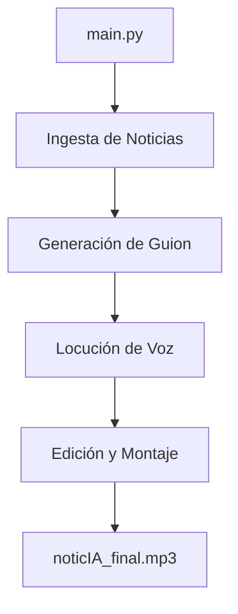

# Workflow de NoticIA: De la Idea al MP3

Este documento detalla el flujo de trabajo completo del sistema NoticIA, desde que se arranca el proceso en `main.py` hasta la generación del archivo de audio final.

## Esquema General

---

## Detalle de las Fases

### 1. Arranque y Configuración (`main.py`)
- Se inicia la ejecución asíncrona.
- Se asegura la existencia de las carpetas `output/` (para el resultado final) y `temp/` (para fragmentos de audio intermedios).

### 2. Ingesta de Noticias (`src/ingesta.py`)
- **Fuentes:** El sistema consulta una lista predefinida de **RSS feeds** organizados por categorías:
    - España, Geopolítica, IA y Actualidad, Ciencia, Friki, Fútbol.
- **Proceso:** 
    - Se utiliza `feedparser` para leer cada URL.
    - Se extraen los 10 titulares y resúmenes más recientes de cada feed.
    - Se limpia el contenido HTML y se limita el resumen a 500 caracteres para optimizar el contexto del LLM.
- **Resultado:** Un diccionario con las noticias agrupadas por categorías.

### 3. Generación de Guion (`src/generador.py`)
- **Motor:** Utiliza la API de **Google Gemini** (modelo `gemini-flash-latest`).
- **Proceso:**
    - Se procesan las categorías secuencialmente.
    - Para cada bloque, se envía un prompt al modelo que incluye:
        - Instrucciones de sistema (personalidad de los locutores).
        - Instrucciones específicas de duración y tono (debate profundo, anécdotas, "mojarse").
        - El contenido de las noticias capturadas.
    - El LLM genera un diálogo estructurado con los prefijos `Álex:` y `Santi:`.
- **Resultado:** Un guion completo en formato texto con la tertulia de todas las categorías.

### 4. Locución de Voz (`src/locutor.py`)
- **Motor:** Utiliza **edge-tts** (Microsoft Edge Text-to-Speech).
- **Proceso:**
    - El guion se parsea línea por línea.
    - Se identifica al locutor por el prefijo:
        - **Álex:** Usa la voz configurada (ej. `es-ES-AlvaroNeural`).
        - **Santi:** Usa la voz configurada (ej. `es-ES-ElviraNeural`).
    - Cada línea de texto se convierte en un archivo `.mp3` individual en la carpeta `temp/`.
- **Resultado:** Una lista de rutas a los fragmentos de audio generados.

### 5. Edición y Montaje (`src/editor.py`)
- **Motor:** Utiliza la librería **pydub**.
- **Proceso:**
    - **Unión de voces:** Se concatenan todos los fragmentos temporales, insertando un pequeño silencio de 500ms entre ellos para dar naturalidad.
    - **Tratamiento de música:**
        - Se carga la sintonía (música de fondo).
        - Se reduce el volumen (aprox. -28dB) para que no tape las voces.
        - Se loopea la música si el diálogo es más largo que la pista original.
        - Se aplican efectos de *fade-in* (entrada suave) y *fade-out* (salida suave).
    - **Mezcla final:** Se superponen las voces sobre la música de fondo.
- **Limpieza:** Se eliminan los archivos temporales de la carpeta `temp/`.
- **Resultado:** El archivo `output/noticIA_final.mp3`.

---

## Requisitos del Sistema
- **Python 3.10+**
- **FFmpeg:** Necesario para que `pydub` pueda manipular archivos MP3.
- **Conexión a Internet:** Para consultar los RSS, llamar a la API de Gemini y generar las voces con edge-tts.
